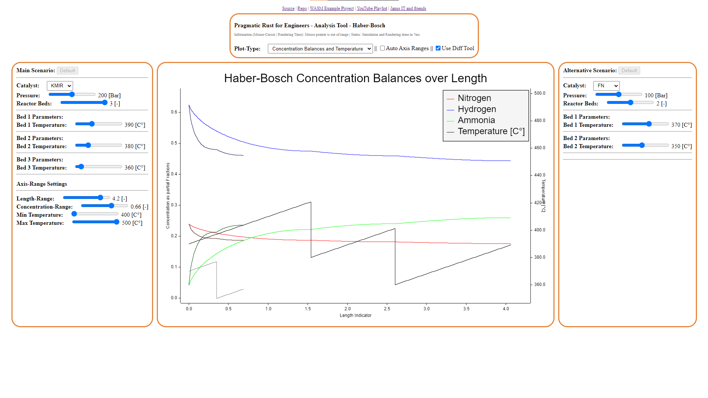

# Pragmatic Rust for Engineers

This repository contains the code for the video tutorials series **Pragmatic Rust for Engineers** by Janus IT and friends. The series teaches
Rust programming and/or to solve engineering problems. Therefore the series addresses two audiences:

1. Rust Programming Learners from Engineering disciplines such as Chemical Engineering, Electric Engineering, Mechanical Engineering, etc.
2. Software Developers who want to apply Rust to tackle engineering problems or/and use Rust in scientific environments.

In the first part of the series we will investigate the Haber-Bosch process for Ammonia production. Haber-Bosch consumes 1.1% of the world's energy supply, and is responsible for 1.8% of the world's CO2 emissions. First, we will concentrate on simulating the reaction along a plug flow reactor, then add some plots to visualize our results and we conclude with some interaction via Web Assembly.

[Read Jonathan Ayalas Blog Article](https://janus.rs/en/2023/12/the-haber-bosch-process-revolutionizing-agriculture-and-industry/) about Haber-Bosch if you want to learn more.

We conclude the first season of Pragmatic Rust for Engineers with a WebAssembly powered tool to analyze the Haber-Bosch reaction.

## How to Learn with Pragmatic Rust for Engineers

[Read Tim Janus Blog Article](https://janus.rs/en/2023/12/why-learning-rust-is-worthwhile-for-engineers/) - if you want to know why learning Rust is worthwhile as an Engineer.

Pragmatic Rust for Engineers is a video series that teaches programming by applied coding on (simplified) engineering problems inspired from the real world. We propose four different learning strategies but it's up to you to choose what suits you best. We just want to add switching difficulty is always possible and redoing on a harder mode is always an option. The content is quite dense so don't beat yourself up, have fun and reach out if you have any questions.

1. Just watch the Video
    - **difficulty: story-mode** - An entertaining time, lean back and learn something.
2. Investigate the Solutions Source Code 
    - **difficulty: easy** - An intense time, dig into the code in `solution.rs` and make sense out of it.
3. Code yourself supported with hints
    - **difficulty: medium** - An adventure with helpful 'NPCs' scatter around the `hints.rs` source files. 
4. Code yourself only based on an implementation plan 
    - **difficulty hard** - A threatening adventure fight `main.rs` alone, you're only gear is your keyboard and mouse.

When choosing 4,3 or 2 you can use git as version control system to support you by restricting access to those files. For each task of the series you'll find three corresponding ordered commits and you can branch out from there.

- `task: task desc` - Contains the implementation plan and task description as markdown file.
- `hint: task desc` - Contains some code and hints that show how tasks can be achieved in Rust programming.
- `solu: task desc` - Contains the solution of the task at the end of the video (probably with some additional documentation)

**If you haven't use git yet, no problem we show how use it in the first videos.**

## Video Directory

Beware sometimes we add the link here but the Video is scheduled later on YouTube.

- [0/x Pragmatic Rust for Engineers: Setting up your Rust Development Environment on Windows](https://www.youtube.com/watch?v=9DU2oglBj54) - 2023-12-04 8:00am CET
- [1/x Pragmatic Rust for Engineers: Steady-state Haber-Bosch Reaction](https://www.youtube.com/watch?v=_phBAnY8vkM) - 2023-12-05 6:30am CET
  - [Tasks](haber_bosch/tasks.md)
  - [Hints](haber_bosch/src/hints.rs)
  - [Solution](haber_bosch/src/solution.rs)
- [2/x Pragmatic Rust for Engineers: Simulate and visualize a multi-bed Haber-Bosch Reactor](https://youtu.be/hofHT09H7bM) - 2023-12-21 6:30am CET
  -  [Tasks](haber_bosch/v2_tasks.md)
  -  [Hints](haber_bosch/src/v2_hints.rs)
  -  Solution consist of [main](haber_bosch/src/v2_main.rs) function and [configuration](haber_bosch/src/configuration.rs), [simulation](haber_bosch/src/simulation.rs) and [visualization](haber_bosch/src/visualization.rs) module.
- [3/x Pragmatic Rust for Engineers: Interactive Haber-Bosch via WASM (Web Assembly)](https://www.youtube.com/watch?v=LW_Vy3QNwX4) - 
  - [Tasks](haber_bosch/v3_tasks.md)
  - [Hints] Contains the implementation we have at the end of the video, see the branch `tj_hints_v3` - or this [git commit](https://github.com/DarthB/pragmatic_rust_for_engineers/commit/8da04a6bb19e023c3f8e59613ea7af3be3469567)
  - [Solution] - Contains the tool that was used to do the analysis in the Video
 
## License

All the code is dual-licensed under either:

- [MIT License](./LICENSE-MIT)
- [Apache License, Version 2.0](./LICENSE-APACHE)

at your option. This means you can select the license you prefer! This dual-licensing approach is the de-facto standard in the Rust ecosystem.

## Your contributions

Unless you explicitly state otherwise, any contribution intentionally submitted for inclusion in the work by you, as defined in the Apache-2.0 license, shall be dual licensed as above, without any additional terms or conditions.