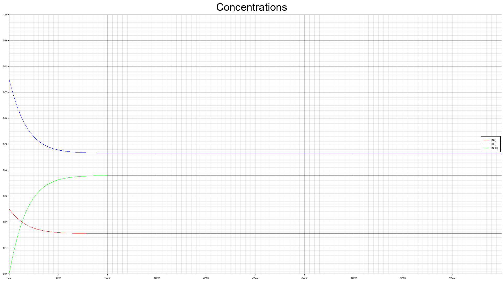

# Haber-Bosch Tasks and Implementation Plan

This file contains coarse step-wise implementation plans for our work with the Haber-Bosch process.

## Video 01 - Steady-state Haber-Bosch Reaction

In this task the Haber-Bosch process will be simulated by using an ODE solver provided by the crate [ode_solvers](https://srenevey.github.io/ode-solvers/).

### Learn Goals

General:

- [ ] (advanced) Model a reaction system as ordinary differential equations (ODEs).
- [ ] (easy) Use a ODE-Solver to solve the ODEs. This simulate the reaction system.
- [ ] (advanced) Critically Investigate the results of the solver. What about units?

Rust:

- [ ] (easy) Implement and call functions in Rust to modularize your code in Rust.
- [ ] (easy) Implement, instantiate and 'dump' a data structure to the terminal.
- [ ] (advanced) Implement a `trait` of an external crate, here an solver for ODEs, to use it's functionality with custom types.
- [ ] (advanced) Coarse Theory behind static type system and ownership

### Implementation Plan and Coarse Tasks

1. Add dependency to ode_solvers (version 0.3.7) in `cargo.toml`   
    - Either run `cargo add ode_solvers --vers 0.3.7` or edit `cargo.toml` directly
    - Run `cargo build` to let the dependencies be built in the background
2. In `main.rs` Implement a function that calculates reaction rates via the arrhenius equation
    - Call it and output the results.
3. In `main.rs` add a `struct` `HaberBoschModel` that contains the model constants as `f64`
    - Instantiate the struct and output the data by deriving the `Debug` trait.
4. Implement the `System` trait of the [ode_solvers crate](https://srenevey.github.io/ode-solvers/) for the `HaberBoschModel` struct
    - Therefore use the three concentration equations given in the video
5. Instantiate the `Dop853` solver and use it to integrate the model
    - Output the `y_out` results to the command line
    - Use an `iterator` and sum the concentrations in each time step.
    - Compare your results with the solution given in the video

### References

As some of your starting your journey with Rust and this course cannot give an in-depth introduction but focuses and solving problems with Rust and on this way just provides **enough** detail, we want to make you aware of those three very good starter materials:

1. [The Rust Book](https://doc.rust-lang.org/book/) - Gives an introduction suitable for people who have experiences in other coding languages.
2. [Rust By Examlpe](https://doc.rust-lang.org/rust-by-example/) - A collection of code examples with short explanations similiar to the `hints.rs` files you find in this course.
3. [Rustlings](https://github.com/rust-lang/rustlings) - A project containing small Rust exercises and let you solve them in an interactive way. It follows the structure of [the rust book](https://doc.rust-lang.org/book/).

Here you will appy, contents of [Chapter 3](https://doc.rust-lang.org/book/ch03-00-common-programming-concepts.html), [Chapter 5](https://doc.rust-lang.org/book/ch05-00-structs.html) and the advanced conept of traits explained in [Chapter 10.2](https://doc.rust-lang.org/book/ch10-02-traits.html).

[Chapter 4](https://doc.rust-lang.org/book/ch04-00-understanding-ownership.html) contains concepts unique to Rust and to understand the difference between Rust and other languages it is very important and exciting. So we recommend a read but it's fine to skip and be fine if you fully understood after first read through. Most do not. 

## Video 02 - Related to plots:

Coming next:

Plotting with the [plotters-rs crate](https://github.com/plotters-rs/plotters) and more on **Iterators**

