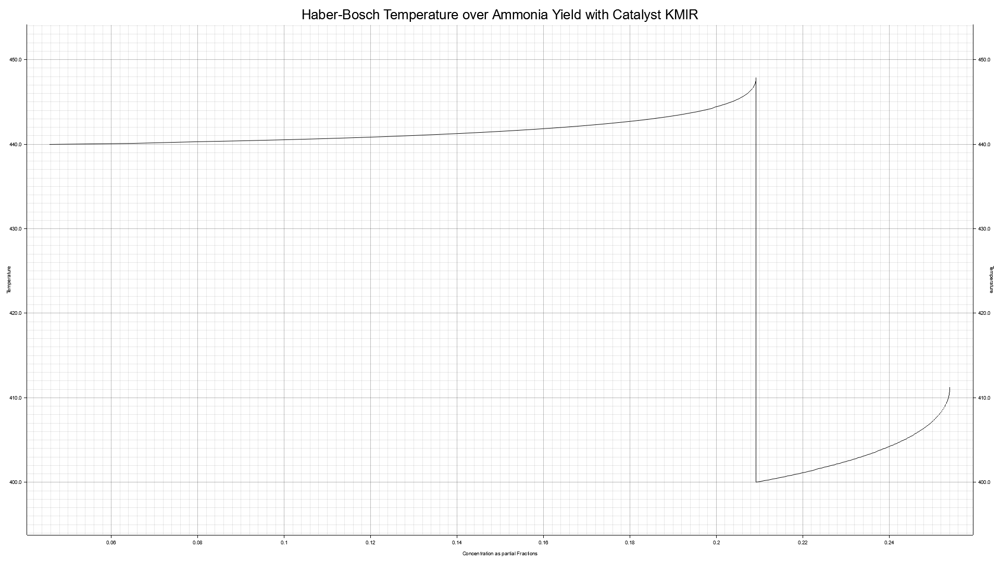
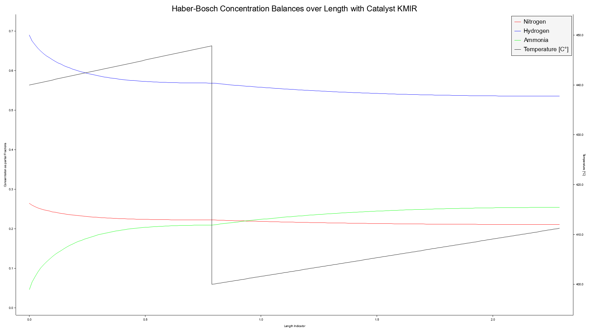
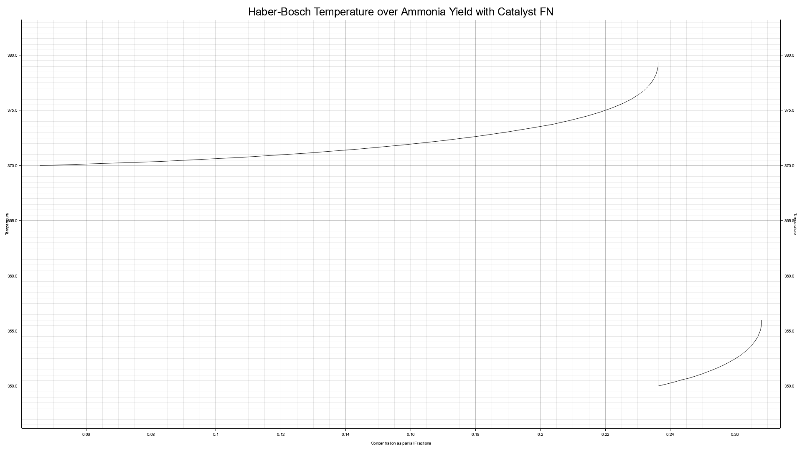
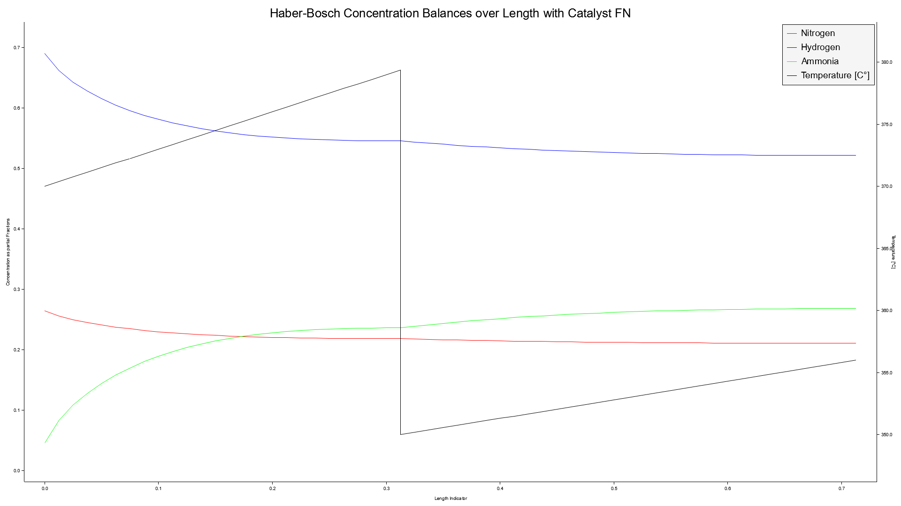

# Tasks - Video 02 - Simulate and visualize a multi-bed Haber-Bosch Reactor

We will first dig into the [Plotters](https://docs.rs/plotters/latest/plotters/) crate and plot simple diagrams.

Then we will successive build up a configuration, simulation and visualization for the model as discussed with Jonathan in the Video.

The constants used by to configure the two case-studies FN and KMIR can be found in [v2_hints.rs](src/v2_hints.rs), even when you checked out the task commit.

The model uses many coefficients and writing the model equations is a bit of grinding work. Therefore, this episodes more sophistcated model is implemented in [v2_hints.rs](src/v2_hints.rs) if you're checked out the hints commit.

## Learn Goals

General:

- [ ] Simulation of a more sophisticated model of a multi-bed Haber-Bosch Reactor
  - [ ] Fugacity coefficients describing non-idealist gas
  - [ ] Dependent on Temperature and Pressure
  - [ ] Use two different Catalysts.
  - [ ] Sequential simulation of a multiple bed reactor
- [ ] Modularization over several files
- [ ] Concepts behind Iterators and Closures

Rust:

- [ ] (easy) Nested Data Structures
- [ ] (easy) The builder pattern
- [ ] (easy) Using Iterators
- [ ] (advanced) Build our own Iterator type
- [ ] (advanced) Coarse Words on Lifetimes in Rust

## Implementation Plan and Tasks Description

We will divide our work in four parts:

1. Implement Plotting Functionality
2. Haber-Bosch: Configuration 
3. Haber-Bosch: Simulation
4. Haber-Bosch: Visualization

### Implement Plotting Functionality

1. (optional - git) Checkout the hints or task commit and create a custom git branch for the upcoming work
2. Adapt the `Cargo.toml` file 
   1. Add dependency to [plotters](https://github.com/plotters-rs/plotters) in version `0.3.5`
   2. Add the following binaries: (keywords for Cargo.toml are `default-run` and `[[bin]]`)
      1.  `hb_ode_test` with `main.rs` as source.
      2.  `hb_plot_test` with `v2_main_plot.rs` as source.
      3.  `hb_seq_simulation` with `v2_main.rs` as source.
3. Draw an empty png to the file system.
4. Add a chart to the plot:
   1. set a caption, label area sizes of 40 and a margin of 12.
   2. use a range of -3 .. 3 for x and -10 .. 10 for y.
   3. create a mesh with a y description, e.g. `magic numbers`.
5. Draw the function `y = x^3` as a `LineSeries`.
6. Refactoring: Extract the chart generation functionality in a helper function `prepare_chart`.
7. Implement an additional function `prepare_chart_dual`.

### Haber-Bosch Configuration

**Reminder**: Constants for the case-studies KMIR and FN can be found in [v2_hint.rs](src/v2_hints.rs) (even if you checked out the task commit).

1. Start modularzing your project:
   1. Add the files `configuration.rs`, `simulation.rs` and `visualization.rs`.
   2. Move the functions `prepare_chart` and `prepare_chart_dual` into `visualization.rs`.
2. In `simulation.rs` add a `HaberBoschModel` structure that contains all the important constants, later we will implement the `System` trait on it.
3. Introduce a nested data-structure that is capable of representing a Haber-Bosch configuration in `configuration.rs`, think about:
   1. What data needs to be store and how can we support any number of reactor beds? 
   2. Use this structure to store results of ODE-solver (`x_out` and `y_out`), what is the dimensionality of `y_out`?
   3. What data is needed by the ODE-solver and how can we provide it?
4. Write an accessor function that provides a data structure, for the n'th bed, that can can be passed to the ODE-Solver.
5. In `v2_main.rs` implement a loop over the to catalysts `catalysts=[KMIR, FN]`, for each:
   1. Generate the nested data structure, use the constants you find for the beds in [hint.rs](src/v2_hints.rs) (optional make use of the Builder pattern)
   2. Access the solver parameters for the first bed 
   3. output them

### Haber-Bosch Simulation

1. Implement the `system` method of the `System` trait for `HaberBoschModel` - **Reminder** This episodes more sophistcated model is implemented in [v2_hints.rs](src/v2_hints.rs) if you're checked out the hints commit. 
2. Implement the `solout` method of the `System` trait for `HaberBoschModel` - Use it to stop the simulation as soon as there is nearly no change in Ammonia.
3. Implement a function `sequential_simulation` with a mutable reference to your nested data structure as a parameter and no return type, the function shall:
   - For each reactor bed:
     - Output the starting point.
     - Simulate it with the `Dopri5` solver (IMPORTANT, other solver do not yet support `solout` but the fix will be in the next version).
     - Store the results in your nested data structure.
4. Add helper methods to the nested data structure:
   - `is_simulation_done` checks if there are as many results as reactor beds.
   - `print_summary` outputs the length of each reactor bed, the complete length and the final yield of Ammonia.
5. Overwork the main loop: Call `sequential_simulation` and output the summary. 

Example Output of `print_summary` to check if your solution is working as expected:
```
Summary based on Catalyst KMIR
Reactor Length: 0.787 + 1.500 = 2.287
Final Yield: 0.22439126651044983

Summary based on Catalyst FN
Reactor Length: 0.313 + 0.400 = 0.712
Final Yield: 0.23430821247073505
```

### Haber-Bosch Visualization

We divide this in two tasks

1. Draw a temparature over yield diagram
2. Draw a concentration balance diagram.

#### Temperature over Yield

1. As perparation implemment the methods:
   1. `get_ammonia_range` that returns a `Range<f32>` the range for plotting on the x-axis
   2. `get_temp_range` that returns a `Range<f32>` for for the y-axis when plotting temperature
2. Add a function `draw_temperature_over_yield` with an `&str` (string slice) as argument for the filename, e.g. `diagram.png`, and a reference to the nested data structure.
   1. Create a chart with axis and labels by using the `prepare_chart`
   2. Store the chart with the corresponding file name

<font color="red">Now we will switch from using Iterators to implementing our own Iterator.</font>

Think about the following requirements:

- We want an Iterator that can be consumed by [plotters](https://docs.rs/plotters/latest/plotters/), over what Item Type will we iterate?
- We want be capable select temperatures and balances as y. The balances may either be concentrations or partial fractions.
- What variables allow us to select the form of y and what internal indicies are needed to iterate over the data in the nested data structure?

1. Add a data structure `MyIterator<'a>` it needs a reference to the nested data structure with lifetime `'a`
2. Remember the requirements above add the config and internal variables to `MyIterator`
3. Implement the `Iterator` trait for `MyIterator`: `impl<'a> Iterator for MyIterator<'a> { ... }`.
   1. Select the Item type
   2. Implement `next` which returns an [Option<T>](https://doc.rust-lang.org/std/option/enum.Option.html) which is an Enum.
4. Add the method `my_iter` to the nested data structure, forward the configuratoin arguments to a new `MyIterator` object and initialize its indicies to point at the first data point in the nested data structure.

#### Concentration Balance Diagram

Use the `my_iter()` method and `prepare_chart_dual` to also render a concentration balance diagram which shows the temperature on the secondary axis.

#### Plots to compare your results with

KMIR Temperature over Yield Diagram



KMIR Concentration Balance Diagram



FN Temperature over Yield Diagram



FN Concentration Balance Diagram



## References

For this Episode we recommend to learn a lot about [Iterators](https://doc.rust-lang.org/book/ch13-02-iterators.html) - There are many methods to adapt or consume them, see the [Iterator Reference]((https://doc.rust-lang.org/std/iter/trait.Iterator.html))

As some of your are starting your journey with Rust and this course cannot give an in-depth introduction but focuses and solving problems with Rust and on this way just provides **enough** detail, we want to make you aware of those very good starter materials:

1. [The Rust Book](https://doc.rust-lang.org/book/) - Gives an introduction suitable for people who have experiences in other coding languages.
2. [Rust By Examlpe](https://doc.rust-lang.org/rust-by-example/) - A collection of code examples with short explanations similiar to the `hints.rs` files you find in this course.
3. [Rustlings](https://github.com/rust-lang/rustlings) - A project containing small Rust exercises and let you solve them in an interactive way. It follows the structure of [the rust book](https://doc.rust-lang.org/book/).
4. [The Cargo book](https://doc.rust-lang.org/cargo/index.html) - although we won't dig deep into it, we will play around with multiple binaries and we have a workspace structure that may become in handy in the future.

Here we will appy, enum for Catalyst represenation. We use only a simple form but `Enums` and `match` are very nice concepts in Rust and you read about them in  [Chapter 6](https://doc.rust-lang.org/book/ch06-00-enums.html)

We use multipe files to modularize our project that is explained in [Chapter 7.2](https://doc.rust-lang.org/book/ch07-02-defining-modules-to-control-scope-and-privacy.html) - Information about the format in Cargo.toml can be found in [The Manifest Format](https://doc.rust-lang.org/cargo/reference/manifest.html)

You can revisit [Chapter 10](https://doc.rust-lang.org/book/ch10-00-generics.html) and learn about use generic data types and explicit lifetimes, we will use both with [plotters]().

And most importantly [Chapter 13.2](https://doc.rust-lang.org/book/ch13-02-iterators.html) explains Iterators and Closures in more detail.